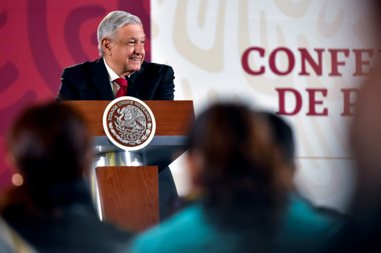

# Conferencias Matutinas ( Mañaneras ) del Presidente Andres Manuel López Obrador



Este repositorio contiene las transcripciones de las versiones estenográficas de las conferencias matutinas del Presidente Andres Manuel López Obrador desde el inicio de las mismas en Diciembre 2018.

El objetivo de este repositorio es mostrar el alcance de análisis de datos aplicado a temas de interés público en México. 

Buscamos que personas con interés en análisis, creación de visualizaciones y con un sentido de curiosidad en datos, cuenten con una base de datos actualizada constantemente con la que se pueda generar contenido que promueva el aprendizaje.

Si observas que este repositorio no ha sido actualizado, solo menciónanos en Twitter ( @nostrodata ) para actualizarlo a la brevedad :)

## Estructura y Formato
Las transcripciones se encuentran ordenadas con la siguiente estructura:
```
— Folder ( mes-año )
  — Folder ( mes dia, año )
    — Folder ( csv_por_participante )
      — CSV's de las intervenciones de cada participante.
    — Folder ( wordmaps_por_participante )
      — PNG's de mapas de las palabras mas usadas por cada participante.
    — CSV de la mañanera completa con todos los participantes.
    — PNG de mapa de las palabras mas usadas por todos los participantes.
```

## Licencia de Uso
El repositorio contiene la licencia: "Creative Commons Attribution Share Alike 4.0 International" que puede ser encontrada en este repositorio en el archivo LICENSE.md y en el siguiente hipervínculo: https://creativecommons.org/licenses/by-sa/4.0/

Si utilizas alguno de los archivos en este repositorio, solo te pedimos nos menciones: @nostrodata ( www.nostrodata.com )

## Síguenos en Nuestras Redes Sociales
https://www.twitter.com/nostrodata

https://www.facebook.com/nostrodata

https://www.instagram.com/nostrodata